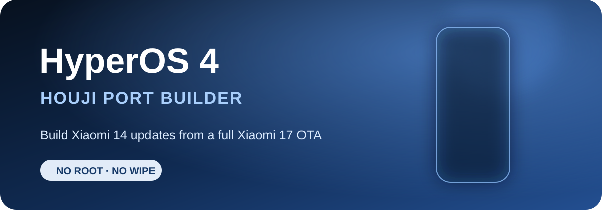

<p align="center">
  <strong>English</strong> ·
  <a href="README_RU.md">Русский</a> ·
  <a href="README_ZH.md">简体中文</a>
</p>

<h1 align="center">HyperOS 4 Port Builder for Xiaomi 14 (houji)</h1>

<p align="center">
  
</p>

<p align="center">
  <strong>HyperOS 4 update builder for Xiaomi 14 (houji)</strong><br>
  Takes a full China OTA for Xiaomi 17 (pudding) and turns it into an update for an existing port.
</p>

<p align="center">
  
  
  
</p>

## What this is

This is my one-click builder for updating a HyperOS 4 port on Xiaomi 14. It validates the OTA, extracts the required partitions, applies the `houji` patches, rebuilds `super`, and produces an update ZIP without formatting `userdata`.

The current port base is China ROM `OS3.0.305.0.WNCCNXM`. The donor must be a full Android 17 Recovery OTA for Xiaomi 17 (`pudding`).

The build does not add root or a custom recovery. Chinese Xiaomi services and features are not intentionally removed.

## Important

This is not official Xiaomi firmware and it is not a universal ROM converter. The builder is made specifically for `houji` + `pudding` and requires a prepared first version of the port.

- Back up your data before flashing anything.
- Never flash the original `pudding` OTA directly on Xiaomi 14.
- The update is designed to keep user data, but a custom port can never be completely risk-free.
- The build stops if the device, Android SDK, patch hashes, or ZIP structure do not match.

## Quick start

If this folder is next to our original `_port_automation` workspace:

1. Run `LINK_LOCAL_FILES.bat`. It links the large local files through NTFS junctions without copying them.
2. Install the Python dependencies:

   ```powershell
   py -m pip install -r requirements.txt
   ```

3. Put one new full `pudding` OTA in `input`, or drag the ZIP onto `BUILD_UPDATE.bat`.
4. Run `BUILD_UPDATE.bat`.
5. The update ZIP, build report, and SHA-256 file will appear in `output`.

You can also start a build manually:

```powershell
python build_port_update.py "D:\ROMs\pudding-ota_full-OS4.x.x.x.zip"
```

A regular GitHub clone needs the local files listed below before it can build an update.

## Requirements

- Windows 10 or 11;
- Python 3.11 or newer;
- WSL with the `Ubuntu-22.04` distribution;
- `simg2simg` installed inside WSL;
- about 32 GiB of free space during the build;
- a full Recovery OTA, not a small incremental update.

The following local files are also required:

- a verified ZIP of the first port release;
- the four Xiaomi 14 base images: `odm`, `system_dlkm`, `vendor`, and `vendor_dlkm`;
- patch files from the prepared port;
- `extract.erofs.exe`, `mkfs.erofs.exe`, and a Linux `lpmake` binary.

Local paths can be overridden in `config.local.json`. Use `config.example.json` as a starting point.

## Firmware downloads

Firmware indexes do not always update at the same time. Check the device codename, region, and full build number before downloading.

### HyperOS 4 Beta sources

- **[Mi Firmware — HyperOS 4](https://mifirmware.com/xiaomi-hyperos-4/)** — a dedicated HyperOS 4 table with China Beta and Recovery ROM entries.
- **[Xiaomi Miui Hellas — HyperOS 4 ROM list](https://xiaomi-miui.gr/hyperos-4-full-changelog-new-features/)** — a list of early HyperOS 4 China Beta builds with download links.
- **[HyperOS Download by Tech Mukul](https://t.me/miui_hyperos_download)** — a Telegram feed with new Stable/Beta builds and mirrors. Verify mirror links against Xiaomi's official OTA server when possible.

### Stable ROMs and archives

- [MIUIROM — Xiaomi 14 (houji)](https://miuirom.org/phones/xiaomi-14) — Recovery, Fastboot, and OTA packages, including China `OS3.0.305.0.WNCCNXM`.
- [XM Firmware Updater — houji](https://xmfirmwareupdater.com/archive/hyperos/houji/) — an archive of untouched official HyperOS ROMs.
- [XiaomiROM — houji China](https://xiaomirom.com/en/rom/xiaomi-14-houji-china-fastboot-recovery-rom/) — Stable and older Weekly/Beta builds.

This builder needs a **full Recovery OTA for `pudding`**. A Fastboot ROM or small incremental OTA will not work.

## Why the firmware is not in this repository

ROM archives, `super.img`, patches, local tools, and build output can take many gigabytes and may contain Xiaomi files. They are intentionally excluded through `.gitignore`.

Git only tracks the builder source, hash manifest, documentation, and small graphics. A local pre-commit hook also rejects firmware archives and tracked files larger than 5 MiB.

Enable it after a regular clone:

```powershell
git config core.hooksPath .githooks
```

## License

You may study, modify, and use the code for personal, non-commercial builds. Reuploading the project, selling builds, removing attribution, or claiming the work as your own is not allowed without written permission. Read the full terms in [LICENSE](LICENSE).

This project uses a source-available license, not a standard open-source license.

## Disclaimer

This project is not affiliated with Xiaomi. Xiaomi and HyperOS are trademarks of their respective owners. Flashing custom software is always done at your own risk.
