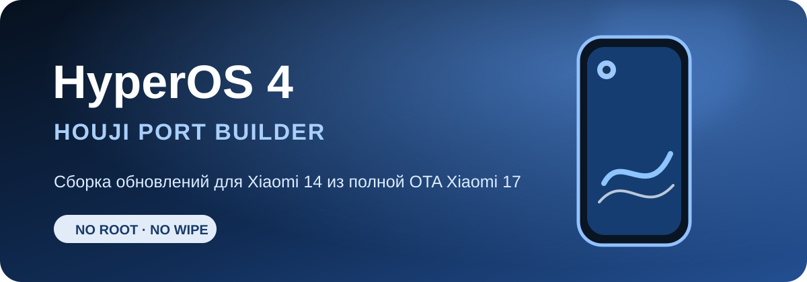

<p align="center">
  <a href="README.md">English</a> ·
  <strong>Русский</strong> ·
  <a href="README_ZH.md">简体中文</a>
</p>

<h1 align="center">Сборщик порта HyperOS 4 для Xiaomi 14</h1>

<p align="center">
  
</p>

<p align="center">
  <strong>На входе две официальные полные OTA. На выходе — готовый China ROM порт.</strong><br>
  База Xiaomi 14 <code>houji</code> + донор Xiaomi 17 <code>pudding</code>, без готового порта.
</p>

<p align="center">
  
  
  
  
</p>

## Что он делает

Это настоящий one-click builder порта HyperOS 4 для Xiaomi 14. ZIP ранее собранного порта ему **не нужен**.

Скрипт проверяет и распаковывает две официальные Recovery OTA, объединяет аппаратную часть Xiaomi 14 с системой HyperOS 4 от Xiaomi 17, применяет проверенный профиль совместимости `houji`, пересобирает EROFS и `super`, восстанавливает AVB-метаданные и полностью проверяет готовые архивы.

Нужны только:

- полная China OTA Xiaomi 14 `OS3.0.305.0.WNCCNXM` (`houji`, Android 16);
- полная China OTA HyperOS 4 от Xiaomi 17 (`pudding`, Android 17).

Результат остаётся максимально близким к China ROM. Рут и кастомное recovery не добавляются, китайские сервисы Xiaomi, ИИ-функции и приложения специально не вырезаются.

## Что получается

Обычная сборка создаёт в `output` два архива:

- `first-install_erase.zip` — первая установка. Прошивает firmware от Xiaomi 14 и сам порт, после чего очищает `userdata` и `metadata`;
- `update-no-wipe.zip` — обновляет уже установленный порт без очистки пользовательских данных. Модем этот пакет никогда не прошивает.

No-wipe архив можно использовать только после первой установки порта из этого проекта. Резервная копия всё равно обязательна.

## Два режима модема

Перед началом первой установки скрипт сам читает аппаратный регион телефона.

1. **Китайская версия телефона** — используется официальный модем из выбранной China OTA Xiaomi 14. Дополнительное подтверждение не требуется.
2. **Не китайская версия** — можно добавить экспериментальный модем. Он работает, но ещё не тестировался долгое время. Скрипт покажет предупреждение и ничего не прошьёт, пока пользователь явно не введёт `EXPERIMENTAL`.

Экспериментального модема в GitHub нет. Проверенный локальный IMG или ZIP можно перетащить на `ADD_EXPERIMENTAL_MODEM.bat` либо передать третьим файлом в `BUILD_PORT.bat`. Если на не китайском аппарате модема нет или пользователь отказался, установка завершится до изменения любых разделов.

## Быстрый старт

1. Установите [Python 3.11+](https://www.python.org/downloads/) и WSL с Ubuntu 22.04:

   ```powershell
   wsl --install -d Ubuntu-22.04
   ```

2. В Ubuntu установите работу с Android sparse images:

   ```bash
   sudo apt update
   sudo apt install android-sdk-libsparse-utils
   ```

3. Установите Python-зависимости:

   ```powershell
   py -m pip install -r requirements.txt
   ```

4. Подготовьте локальные инструменты:

   ```text
   tools/
   ├─ avbtool.py
   ├─ erofs-utils/
   │  ├─ extract.erofs.exe
   │  └─ mkfs.erofs.exe
   └─ android-tools-static/android-tools-static/
      ├─ lpmake
      ├─ lpdump
      └─ simg2img
   ```

   Исходные проекты: [erofs-utils](https://github.com/erofs/erofs-utils), [android-tools-static](https://github.com/meator/android-tools-static) и официальные [Android Platform Tools](https://developer.android.com/tools/releases/platform-tools). Если инструменты уже лежат в другом месте, выполните `LINK_LOCAL_FILES.bat "D:\путь\к\tools"` — будет создан junction без копирования.

5. Положите обе полные официальные OTA в `input` и запустите `BUILD_PORT.bat`. Можно просто перетащить два ZIP на этот bat-файл.

6. Распакуйте готовый пакет и запустите `FLASH_FIRST_INSTALL_AND_ERASE.bat`, когда разблокированный Xiaomi 14 находится в Fastboot. Положите официальный `fastboot.exe` рядом со скриптом или добавьте Platform Tools в `PATH`.

На время сборки нужно минимум **48 ГиБ свободного места**. Пути и название WSL-дистрибутива можно поменять через `config.local.json`, взяв за основу `config.example.json`.

## Поддержка версий

Для `OS4.0.0.9.XPCCNXM` есть точный профиль совместимости с проверкой хэшей. Патчи камеры, framework и services применяются только при полном совпадении исходных файлов.

Новую полную OTA от `pudding` тоже можно попробовать без готового порта: builder возьмёт штатную камеру `houji`, а новый framework до проверки оставит без бинарных патчей. Он выведет крупное предупреждение, потому что корректно собранный архив ещё не означает проверенную на телефоне прошивку. После тестирования для новой версии можно добавить отдельный проверенный профиль.

База Xiaomi 14 пока намеренно зафиксирована на `OS3.0.305.0.WNCCNXM`.

## Где брать прошивки

Всегда проверяйте кодовое имя, регион, полный номер версии и тип OTA.

### Источники с HyperOS 4 Beta

- **[Mi Firmware — HyperOS 4](https://mifirmware.com/xiaomi-hyperos-4/)**
- **[Xiaomi Miui Hellas — список HyperOS 4](https://xiaomi-miui.gr/hyperos-4-full-changelog-new-features/)**
- **[Канал HyperOS Download](https://t.me/miui_hyperos_download)** — пользовательские зеркала; по возможности выбирайте ссылку на официальный OTA-сервер Xiaomi.

### Архивы прошивок Xiaomi 14

- [MIUIROM — Xiaomi 14 (houji)](https://miuirom.org/phones/xiaomi-14)
- [XM Firmware Updater — архив houji](https://xmfirmwareupdater.com/archive/hyperos/houji/)
- [XiaomiROM — houji China](https://xiaomirom.com/en/rom/xiaomi-14-houji-china-fastboot-recovery-rom/)

Подходят только полные Recovery OTA. Fastboot ROM и маленькие инкрементальные обновления будут отклонены.

## Безопасность

- Нужен разблокированный загрузчик. В готовых `vbmeta` отключается AVB verification; блокировать загрузчик обратно на этом порте нельзя — можно получить кирпич.
- Никогда не прошивайте исходную OTA от `pudding` прямо на Xiaomi 14.
- Первая установка безвозвратно удаляет приложения, настройки и файлы внутренней памяти.
- Скрипты проверяют модель телефона, наличие образов и результат каждой fastboot-команды. При первой ошибке прошивка останавливается.
- Проект неофициальный и предназначен только для этой пары устройств. Все действия выполняются на свой риск.

## Размер репозитория и лицензия

OTA, распакованные разделы, инструменты, модемы и результаты сборки исключены через `.gitignore`. В Git находятся только builder, небольшие бинарные патчи, хэши, документация и графика. Ограничитель размера включается командой:

```powershell
git config core.hooksPath .githooks
```

Код разрешено использовать для личных некоммерческих сборок. Перезаливать проект, продавать сборки, удалять авторство или присваивать работу без письменного разрешения нельзя. Полные условия — в [LICENSE](LICENSE).

Проект не связан с Xiaomi. Названия Xiaomi и HyperOS принадлежат их владельцам.
