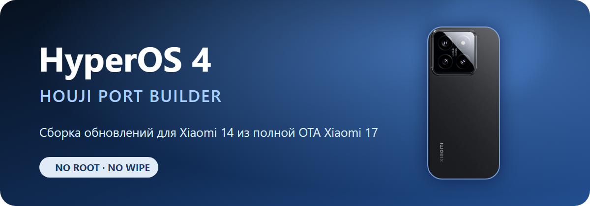

<p align="center">
  <a href="README.md">English</a> ·
  <strong>Русский</strong> ·
  <a href="README_ZH.md">简体中文</a>
</p>

<h1 align="center">Сборщик порта HyperOS 4 для Xiaomi 14 (houji)</h1>

<p align="center">
  
</p>

<p align="center">
  <strong>Сборщик обновлений HyperOS 4 для Xiaomi 14 (houji)</strong><br>
  Берёт полную China OTA от Xiaomi 17 (pudding) и переносит её поверх уже установленного порта.
</p>

<p align="center">
  
  
  
</p>

## Что это

Это мой рабочий one-click builder для обновления порта HyperOS 4 на Xiaomi 14. Скрипт проверяет OTA, извлекает нужные разделы, накладывает патчи для `houji`, заново собирает `super` и делает готовый ZIP без форматирования `userdata`.

Текущая база порта — China ROM `OS3.0.305.0.WNCCNXM`. Донор — полный Recovery OTA для Xiaomi 17 (`pudding`) на Android 17.

Рута и кастомного recovery в сборке нет. Китайские сервисы и функции Xiaomi не вырезаются специально.

## Важно

Это не официальная прошивка Xiaomi и не универсальный конвертер. Скрипт рассчитан только на связку `houji` + `pudding` и на подготовленную первую версию порта.

- Перед прошивкой сделайте резервную копию.
- Не прошивайте оригинальную OTA от `pudding` прямо на Xiaomi 14.
- Обновление задумано без очистки данных, но нулевого риска при работе с портом не бывает.
- Если проверка устройства, Android SDK, хэшей патчей или структуры ZIP не проходит, сборка останавливается.

## Быстрый старт

Если эта папка лежит рядом с нашей исходной `_port_automation`:

1. Запустите `LINK_LOCAL_FILES.bat`. Он подключит тяжёлые файлы через NTFS junction и ничего не будет дублировать.
2. Установите Python-зависимости:

   ```powershell
   py -m pip install -r requirements.txt
   ```

3. Положите новую полную OTA от `pudding` в папку `input` или перетащите ZIP на `BUILD_UPDATE.bat`.
4. Запустите `BUILD_UPDATE.bat`.
5. Готовый архив, отчёт и SHA-256 появятся в `output`.

Можно запустить сборку и вручную:

```powershell
python build_port_update.py "D:\ROMs\pudding-ota_full-OS4.x.x.x.zip"
```

Для обычного клона с GitHub сначала нужно подготовить локальные файлы, перечисленные ниже.

## Что нужно на компьютере

- Windows 10 или 11;
- Python 3.11 или новее;
- WSL с дистрибутивом `Ubuntu-22.04`;
- `simg2simg` внутри WSL;
- около 32 ГБ свободного места на время сборки;
- полный Recovery OTA, а не инкрементальный пакет.

Локально также нужны:

- проверенный ZIP первой версии порта;
- четыре базовых образа `odm`, `system_dlkm`, `vendor`, `vendor_dlkm` от Xiaomi 14;
- файлы патчей из подготовленной версии порта;
- `extract.erofs.exe`, `mkfs.erofs.exe` и Linux-бинарник `lpmake`.

Пути можно переопределить в `config.local.json`. За образец возьмите `config.example.json`.

## Где брать прошивки

Сайты иногда обновляются не одновременно, поэтому всегда сверяйте кодовое имя, регион и полный номер сборки.

### Есть HyperOS 4 Beta

- **[Mi Firmware — HyperOS 4](https://mifirmware.com/xiaomi-hyperos-4/)** — отдельная таблица HyperOS 4, включая China Beta и Recovery ROM.
- **[Xiaomi Miui Hellas — HyperOS 4 ROM list](https://xiaomi-miui.gr/hyperos-4-full-changelog-new-features/)** — список первых China Beta-сборок HyperOS 4 со ссылками.
- **[HyperOS Download by Tech Mukul](https://t.me/miui_hyperos_download)** — Telegram-лента с новыми Stable/Beta-сборками и зеркалами. Ссылку на файл лучше дополнительно сверить с официальным OTA-сервером Xiaomi.

### Обычные Stable, Beta и архивы

- [MIUIROM — Xiaomi 14 (houji)](https://miuirom.org/phones/xiaomi-14) — Recovery, Fastboot и OTA, включая China `OS3.0.305.0.WNCCNXM`.
- [XM Firmware Updater — houji](https://xmfirmwareupdater.com/archive/hyperos/houji/) — архив нетронутых официальных HyperOS ROM.
- [XiaomiROM — houji China](https://xiaomirom.com/en/rom/xiaomi-14-houji-china-fastboot-recovery-rom/) — Stable и старые Weekly/Beta-сборки.

Для этого builder нужен именно **полный Recovery OTA от `pudding`**. Fastboot ROM и маленький инкрементальный OTA не подойдут.

## Почему в GitHub нет прошивки

ROM, `super.img`, патчи, локальные инструменты и результаты сборки занимают гигабайты и могут содержать файлы Xiaomi. Поэтому они намеренно исключены через `.gitignore`.

В Git попадают только исходники builder, манифест хэшей, документация и маленькая графика. Локальный pre-commit hook отклонит архив прошивки или любой отслеживаемый файл тяжелее 5 МБ.

После обычного клонирования включите его одной командой:

```powershell
git config core.hooksPath .githooks
```

## Лицензия

Код можно изучать, менять и использовать для личной некоммерческой сборки. Перезаливать проект, продавать сборки, убирать авторство или выдавать работу за свою без письменного разрешения нельзя. Полный текст находится в [LICENSE](LICENSE).

Это source-available лицензия, а не стандартная open-source лицензия.

## Отказ от ответственности

Проект не связан с Xiaomi. Названия Xiaomi и HyperOS принадлежат их владельцам. Любая прошивка кастомного ПО выполняется на ваш риск.
