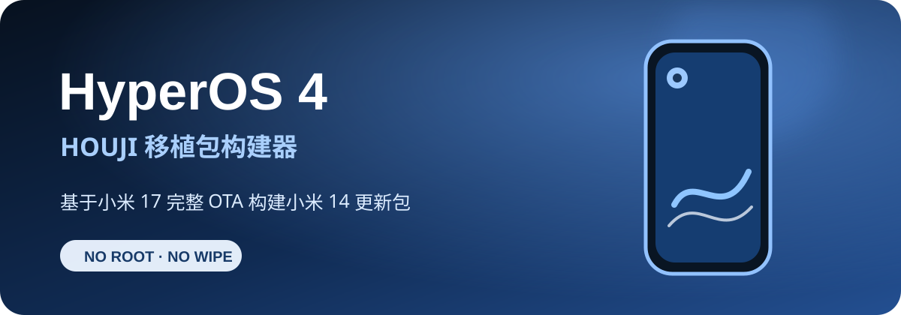

<p align="center">
  <a href="README.md">English</a> ·
  <a href="README_RU.md">Русский</a> ·
  <strong>简体中文</strong>
</p>

<h1 align="center">小米 14 HyperOS 4 移植包构建器</h1>

<p align="center">
  
</p>

<p align="center">
  <strong>输入两个官方完整 OTA，输出可刷入的中国版移植包。</strong><br>
  小米 14 <code>houji</code> 底包 + 小米 17 <code>pudding</code> 供体，不需要现成移植包。
</p>

<p align="center">
  
  
  
  
</p>

## 功能说明

这是一个真正的小米 14 HyperOS 4 一键移植包构建器，**不需要**已制作好的移植包 ZIP。

脚本会校验并解包两个官方 Recovery OTA，将小米 14 的硬件相关部分与小米 17 的 HyperOS 4 用户空间组合，应用经过验证的 `houji` 兼容配置，重新构建 EROFS 和 `super`，重建 AVB 元数据，并完整校验最终 ZIP。

只需要：

- 小米 14 中国版完整 OTA：`OS3.0.305.0.WNCCNXM`（`houji`，Android 16）；
- 小米 17 中国版 HyperOS 4 完整 OTA（`pudding`，Android 17）。

构建结果尽量保持中国版 ROM 原样，不添加 Root 或第三方 Recovery，也不会主动删除小米中国版服务、AI 功能和应用。

## 输出文件

一次普通构建会在 `output` 中生成两个压缩包：

- `first-install_erase.zip` — 首次安装，刷入小米 14 固件和移植系统，然后清除 `userdata` 与 `metadata`；
- `update-no-wipe.zip` — 在已安装本项目移植系统的设备上免清数据更新，绝不会刷写基带。

免清数据包只能用于已经完成本项目首次安装的设备。即使使用更新包，也请提前备份。

## 两种基带模式

首次安装脚本会在任何刷写操作之前读取手机的硬件地区。

1. **中国版设备** — 使用所选小米 14 中国版 OTA 内的官方基带，不需要额外确认。
2. **非中国版设备** — 可以加入可选的实验性基带。它可以工作，但尚未经过长期测试。脚本会显示风险说明；只有用户明确输入 `EXPERIMENTAL` 后才会开始刷写。

实验性基带不会上传到 GitHub。可以把已核验的 IMG 或 ZIP 拖到 `ADD_EXPERIMENTAL_MODEM.bat`，也可以作为第三个文件传给 `BUILD_PORT.bat`。非中国版设备如果没有加入该基带或用户拒绝，首次安装会在修改任何分区之前停止。

## 快速开始

1. 安装 [Python 3.11 或更高版本](https://www.python.org/downloads/)，并安装带 Ubuntu 22.04 的 WSL：

   ```powershell
   wsl --install -d Ubuntu-22.04
   ```

2. 在 Ubuntu 中安装 Android sparse image 工具：

   ```bash
   sudo apt update
   sudo apt install android-sdk-libsparse-utils
   ```

3. 安装 Python 依赖：

   ```powershell
   py -m pip install -r requirements.txt
   ```

4. 准备以下本地工具目录：

   ```text
   tools/
   ├─ avbtool.py
   ├─ erofs-utils/
   │  ├─ extract.erofs.exe
   │  └─ mkfs.erofs.exe
   └─ android-tools-static/android-tools-static/
      ├─ lpmake
      ├─ lpdump
      └─ simg2img
   ```

   上游项目：[erofs-utils](https://github.com/erofs/erofs-utils)、[android-tools-static](https://github.com/meator/android-tools-static) 和官方 [Android Platform Tools](https://developer.android.com/tools/releases/platform-tools)。如果工具已放在其他目录，可运行 `LINK_LOCAL_FILES.bat "D:\path\to\tools"` 创建 junction，无需复制。

5. 将两个官方完整 OTA ZIP 放入 `input`，然后运行 `BUILD_PORT.bat`。也可以直接把两个 ZIP 拖到该 bat 文件上。

6. 解压生成的刷机包，让已解锁的小米 14 进入 Fastboot 后运行 `FLASH_FIRST_INSTALL_AND_ERASE.bat`。将官方 `fastboot.exe` 放在脚本旁边，或把 Platform Tools 加入 `PATH`。

构建期间至少需要 **48 GiB 可用空间**。可用 `config.local.json` 修改路径和 WSL 发行版名称，格式参考 `config.example.json`。

## 版本支持

`OS4.0.0.9.XPCCNXM` 带有精确并校验哈希的兼容配置。只有源文件完全匹配时，才会应用相机、framework 和 services 的差分补丁。

新的 `pudding` 完整 OTA 也可以在没有现成移植包的情况下尝试构建：脚本会改用原生 `houji` 相机，并暂时保留新供体 framework。它会显示醒目警告，因为结构校验通过不代表已经在真机上验证。完成测试后可为新版本加入独立的验证配置。

目前小米 14 底包固定为 `OS3.0.305.0.WNCCNXM`。

## 固件下载

构建前请核对设备代号、地区、完整版本号和 OTA 类型。

### 发布 HyperOS 4 Beta 的来源

- **[Mi Firmware — HyperOS 4](https://mifirmware.com/xiaomi-hyperos-4/)**
- **[Xiaomi Miui Hellas — HyperOS 4 列表](https://xiaomi-miui.gr/hyperos-4-full-changelog-new-features/)**
- **[HyperOS Download 频道](https://t.me/miui_hyperos_download)** — 社区镜像；如有可能，请优先选择小米官方 OTA 服务器链接。

### 小米 14 固件归档

- [MIUIROM — 小米 14（houji）](https://miuirom.org/phones/xiaomi-14)
- [XM Firmware Updater — houji 归档](https://xmfirmwareupdater.com/archive/hyperos/houji/)
- [XiaomiROM — houji 中国版](https://xiaomirom.com/en/rom/xiaomi-14-houji-china-fastboot-recovery-rom/)

仅支持完整 Recovery OTA。Fastboot ROM 和小型增量更新会被拒绝。

## 安全提示

- 必须解锁 Bootloader。生成的 `vbmeta` 会关闭 AVB 验证；使用本移植系统时不要重新上锁，否则可能导致设备变砖。
- 不要把原始 `pudding` OTA 直接刷入小米 14。
- 首次安装会永久删除应用、设置和内部存储文件。
- 刷机脚本会检查连接设备、所需镜像和每条 fastboot 命令，发生错误时立即停止。
- 本项目非官方且仅适用于指定设备组合，刷写风险由用户自行承担。

## 仓库大小与许可证

OTA、已解包分区、工具、基带镜像和构建结果均被 `.gitignore` 排除。Git 只保存构建器、小型二进制差分、哈希清单、文档和图片。克隆后可启用大小保护：

```powershell
git config core.hooksPath .githooks
```

代码仅允许个人、非商业用途。未经书面许可，不得重新上传项目、销售构建包、删除署名或将本项目据为己有。完整条款见 [LICENSE](LICENSE)。

本项目与小米无关。Xiaomi 与 HyperOS 商标归其各自所有者所有。
